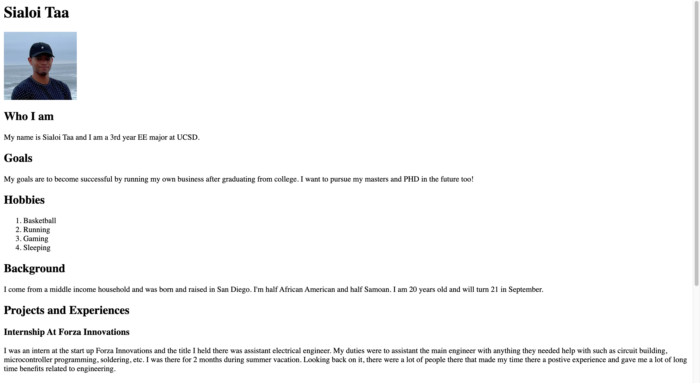
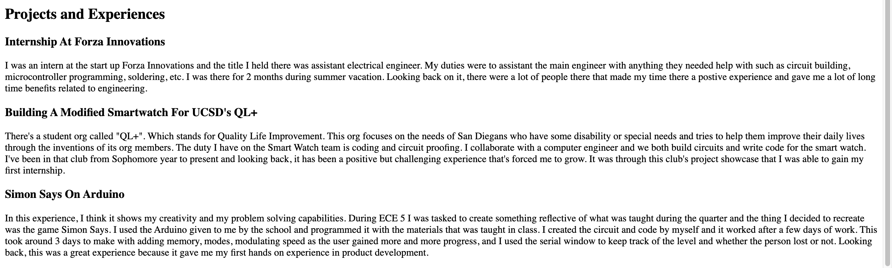

Name: Sialoi Taa
PID: A16662774
Date Started: 1/15/23

Main Overview:
In this technical assignment, I was taught what different types of repositories there were and how to interact with them. This assignment gave me hands on practice with GitHub, Python, and creating a web server.

Tutorial 1 - Git
In this tutorial, I was given the tools to download the git bash or the GitHub desktop application. I was told that GitHub is a place where remote repositories live and our computers store code and files on the local repository. Using git bash, I was able to clone, initiate, and link local and remote repositories through my terminal. By the end of this tutorial, I was able to communicate between my local and remote repository.

Tutorial 2 - Python Install and Setup
In this part of the technical assignment, I learned about virtual environments and global environments and why they're important. I installed Anaconda, created a virtual environment, and now use it when installing packages. Next I installed an IDE (VS Code) and tried PyCharm out. The purpose of this tutorial was to setup my hardware to be able to build and run customizable software and enable software creation on my machines.

Tutorial 3 - Python Basics
In this tutorial, I was taught about the basics of Python. I was taught about lists [], dictionaries {}, list comprehensions, tuples (), array slicing, how to comment, how to use string methods, how to create a function, and some Python key words. For practice, the tutorial made me print out a statement to the terminal: "Hello, ECE 140A World!". Lastly, it told us an interesting if condition statement using the name of the file that will change depending on how the file is being used.

Tutorial 4 - Web Serving with FastAPI
In this tutorial, the purpose was to teach about how the FastAPI packaging could enable us to create a local host. This tutorial involved creating an HTML file that represented the web page and a Python file that creates and enables the server while it's being ran. 

Challenge 1 - Python Review
In this challenge, there were multiple exercises testing us on how well we could use the newly acquired Python knowledge to create programs that solved simple math problems, string manipulations, and the use of dictionaries.

# 1
In the first question, I used a list comprehension to create a list of the squared numbers from 1 to 10. Inside the list comprehension, I had for the numbers 1 through 10, square them and put them inside a list that the function would return.

# 2
In the second question, I used a try and except statement to implement code that caught invalid entries and returned nothing. While the invalid entries returned nothing, valid entries went through the rest of the code and by adding all of the numbers in the list and dividing them by the number of numbers present I was able to obtain the average value. I then returned this value and the function ended.

# 3
In the third question, I had to define an is_prime function and a prime_100 function. For the is_prime function, I used 2 if statements, 1 if-else statement, and a for loop to determine whether the input was a pime number. I used the 2 if statements to determine if the input was a valid argument (it was made known in the challenge that the input would always be valid but I wanted to add these in for good practice). The conditions were that the argument was a non-positive natural number that is divisible by 1 or itself. So the if statements checks if the argument is either less than 0, is 0, or 1. If it's less than 0, the function ends and returns nothing. If the argument is 0 or 1, then the function returns True, indicating that the argument is a prime number. After getting past the validation process, the for loop iterates from 1 to the argument number. The if-else statement asks if the number it's currently on is bigger than the argument number if the iteration number is squared. If it is then the number is a prime number and the function returns True. If it's not, then the else section determines how much is leftover if the argument number modulo the iteration number is non-zero. If it's nonzero then the argument is prime at the present, however if the remainder is 0 then the argument is determined to be not a prime then the function ends with it return False in the end.

For the prime_100, I used a while statement and an if statement. I needed to print the first 100 prime numbers so without knowing how many iterations I would need I chose to use a while loop. The condition for exiting the loop was finding 100 prime numbers. Inside the while loop I had an if statement that checked if the iteration number is a prime number using the function is_prime. If True then the iteration number is placed in a list of prime numbers, and the prime counter is incremented by 1. After the while loop is exited, the function will end and return the list of prime numbers

# 4
In the fourth question, I had to count the number of times each letter was being used and return a dictionary that showed those occurences. I first creted a dictionary that had a lower case letter associated to a number, which would track the number of occurences. I then used a for loop to iterate through the characters of the input string and placed them into the dictonary as key words and incremented the number associated with them. Inside the for loop I also had to parse through the characters to make sure there was no punctuation. So what I did was create a string that had every punctuation character and whitespace that I banned from getting passed into any of the next section of the for loop, otherwise I would get an invalid access key error. After all of the characters were looped through, the function ended and returned the dictonary.

# 5
In the fifth question, I had to take a list of strings (meaning multiple strings in 1 list), delete the ones that had no vowels or less than 5 characters, and then return the list of filtered strings. I started by using a try except method that will catch invalid input types. After that, I created a filtered list to be returned later. I then created a string that had all of the vowels and 2 booleans that tracked if the conditions for a string were met. In a 2 for loops, I iterated through the individual strings and then its characters. For each character, there's 2 things to be considered: Is it a vowel? and is that the 5th character or is it past it? A yes to either of these questions will make a boolean value flip to True and when both boolean values are True, it exits the second for loop and adds that string to the filtered list. If at the end of the second for loop, the 2 booleans aren't both True then the string isn't added to new list of strings. At the end of each first for loop, the booleans and character counter is reset.

At the end of the file I have all of the questions' testing lines. I can use them to debug and since I have it in the if main statement, if this file were to be used by another file (being imported), then the testing code won't be outputted.

Challenge 2 - Web Serving Review
In this challenge I created an HTML file and programmed for a web page. In the end, I added headers of different types, a title tag, paragraphs, and a picture. To include an image, I had to create an images folder and contain the picture there. To display an image on the web page, I had to edit the HTML file to look for that folder and image name to include it inside the HTML so when the app.py file ran, the browser would render the picture in with the HTML file. 

